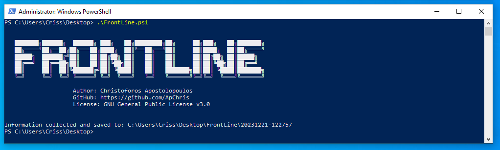
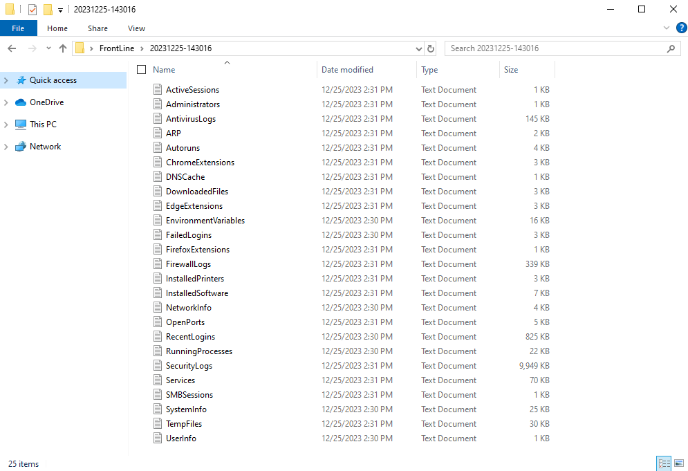
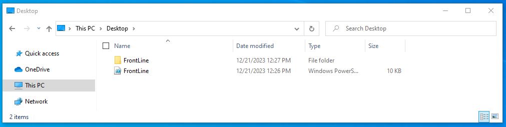

# FrontLine

FrontLine is a PowerShell-based tool designed for comprehensive Windows system analysis, focusing on security-related aspects, network configurations, installed software, and more. This tool is crafted to provide administrators and security professionals with valuable insights into the state and configuration of a Windows environment.

## Key Features:

### 1. System Information:
Retrieve comprehensive system information, including hardware details, operating system configuration, and user information.

### 2. Process and Service Analysis:
List running processes and services on the system.

### 3. Network Analysis:
Capture network-related data, including active sessions, open ports, and SMB sessions.

### 4. Security Event Logs:
Extract security event logs, firewall logs, and antivirus logs to identify potential security incidents.

### 5. Software Inventory:
Enumerate installed software, both 32-bit and 64-bit applications, providing an overview of the software landscape.

### 6. Autorun and Services:
Display information about startup commands, services, and administrators on the system. Note that the Autoruns feature provides a basic overview of autorun entries from common locations, offering insights into potential areas of interest. For a more detailed analysis, consider using specialized tools like Autoruns from Sysinternals.

### 7. Printers and File System:
List installed printers and identify files and folders created in specific timeframes.

### 8. Web Browser Extensions:
Extract details about extensions installed in Microsoft Edge, Google Chrome, and Mozilla Firefox.

### 9. DNS and ARP Information:
Collect DNS cache configuration and ARP details for thorough network analysis.

## Usage:
Ensure the script is run with elevated privileges (Run as Administrator).\
Execute the script, and the tool will automatically generate a structured output with categorized information.\
The results will be organized in a timestamped folder within the "FrontLine" root directory, facilitating easy navigation.

## Disclaimer:
FrontLine is intended for educational and informational purposes only. Use this tool responsibly and adhere to legal and ethical guidelines when performing system analysis.
